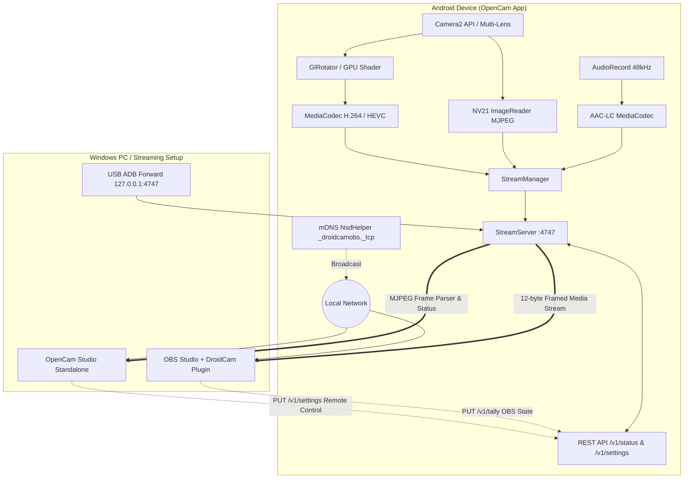

<div align="center">

# 📷 OpenCam

### Free, Open-Source, Ultra-Low-Latency Wireless & USB Webcam for OBS Studio & Windows

[](https://github.com/soupashh-ship-it/opencam/releases/latest)
[](https://github.com/soupashh-ship-it/opencam/actions/workflows/ci.yml)
[-3DDC84?logo=android&logoColor=white&style=flat-square)](https://developer.android.com)
[](https://github.com/soupashh-ship-it/opencam/releases)
[](https://obsproject.com/)
[](LICENSE)
[](#why-opencam)

<p align="center">
  <b>Transform your Android phone into a studio-grade 4K 60FPS webcam.</b><br>
  Native integration with OBS Studio via <code>droidcam-obs-plugin</code> + Standalone Windows OpenCam Studio client.
</p>

[**🌐 Live Documentation & Showcase**](https://soupashh-ship-it.github.io/opencam/) &nbsp;•&nbsp;
[**📥 Download Latest APK**](https://github.com/soupashh-ship-it/opencam/releases/latest) &nbsp;•&nbsp;
[**🚀 Quick Start**](#-quick-start) &nbsp;•&nbsp;
[**⚡ Features**](#-key-features) &nbsp;•&nbsp;
[**📡 Wire Protocol**](#-wire-protocol--developer-api) &nbsp;•&nbsp;
[**🛠️ Architecture**](#-system-architecture)

---

</div>

## 🌟 Why OpenCam?

Most mobile webcam applications restrict basic functionality like 1080p/4K resolutions, 60 FPS, multi-lens selection, or audio streaming behind paid paywalls, subscriptions, or intrusive watermarks.

**OpenCam is 100% free, libre, and open-source.** It delivers an unconstrained clean-room implementation of the high-performance DroidCam OBS protocol, connecting seamlessly to your streaming setup with zero bloat.

### 📊 Feature Comparison

| Capability | OpenCam | DroidCam (Free) | Camo (Free) | Iriun (Free) | EpocCam (Free) |
|---|:---:|:---:|:---:|:---:|:---:|
| **Price** | **100% Free & Open** | Freemium ($5.99) | Freemium ($49.99/yr) | Freemium ($7.99) | Freemium ($7.99) |
| **Max Resolution** | **Up to 4K UHD** | 480p / 720p limit | 720p limit | 4K | 720p limit |
| **Max Frame Rate** | **Up to 60 FPS** | 30 FPS | 30 FPS | Up to 60 FPS | 30 FPS |
| **Watermarks / Ads** | **None (Zero)** | Ads in free | Watermark | Watermark/Nag | Watermark |
| **Hardware Codecs** | **HEVC (H.265), H.264, MJPEG** | Limited | Proprietary | Proprietary | Proprietary |
| **OBS Studio Native Plugin** | **✅ Native Plug-and-Play** | ✅ | ❌ (Virtual Cam) | ❌ (Virtual Cam) | ❌ (Virtual Cam) |
| **Standalone PC Client** | **✅ OpenCam Studio** | ✅ | ✅ | ✅ | ✅ |
| **Two-Way Remote Control** | **✅ Torch, Zoom, Lens, FPS** | ❌ (Pro only) | ❌ (Pro only) | ❌ | ❌ |
| **Zero-Lag USB Mode** | **✅ Built-in (ADB)** | ✅ | ✅ | ✅ | ✅ |
| **Screen-Off Background Stream** | **✅ Foreground Service** | ❌ (Pro only) | ❌ | ❌ | ❌ |
| **Multi-Lens Switching** | **✅ Front / Back / Wide / Tele** | ❌ (Pro only) | ❌ (Pro only) | ❌ | ❌ |
| **Realtime OBS Tally Light** | **✅ Program / Preview / Idle** | ❌ | ❌ | ❌ | ❌ |

---

## ⚡ Key Features

- **🚀 Ultra-Low Latency Streaming**: Optimized TCP network framing with `TCP_NODELAY` and bounded drop-oldest queues ensures sub-frame latency over Wi-Fi and wired USB.
- **🎥 4K & 60 FPS Video Pipeline**: Hardware-accelerated encoding using Android `MediaCodec` for **HEVC (H.265)**, **AVC (H.264)**, and low-CPU **MJPEG** with direct GPU OpenGL ES color and rotation conversion.
- **🎙️ Studio-Synchronized AAC Audio**: Low-latency 48 kHz AAC-LC streaming from phone mic with cumulative sample timestamping to eliminate A/V drift.
- **🎛️ Bi-Directional PC Control**: Control your phone camera live from your PC desktop (Torch, Pinch/Slider Zoom, Lens Switching, Exposure, Bitrate, Resolution, and FPS).
- **🖥️ Dual Usage Models**:
  - **OBS Studio**: Works out of the box with the standard open-source [`droidcam-obs-plugin`](https://github.com/dev47apps/droidcam-obs-plugin).
  - **OpenCam Studio**: Native lightweight Windows client for instant preview, screenshots, virtual camera routing, and remote controls.
- **🔌 Zero-Lag USB Tethering**: High-speed USB streaming via standard Android ADB port forwarding (`adb forward tcp:4747 tcp:4747`).
- **🔍 Auto-Discovery (mDNS)**: Zero-configuration network pairing using `_droidcamobs._tcp` Bonjour/mDNS service broadcast and interactive QR pairing.
- **🔋 Live Telemetry & Tally Reporting**: Live battery percentage tracking and active OBS tally status (Red for Program On-Air, Amber for Preview, Grey for Idle).
- **🌙 Screen-Off Background Streaming**: Fully managed Android Foreground Service keeps stream alive even when switching apps or locking your phone screen.
- **🪞 Hardware Mirror & Rotation**: Seamless front-camera mirroring and automatic display orientation synchronization (0°, 90°, 180°, 270°).

---

## 🚀 Quick Start

### Option 1: Using with OBS Studio (Recommended)

1. **Install OpenCam APK** on your Android phone from [Releases](https://github.com/soupashh-ship-it/opencam/releases/latest).
2. **Install DroidCam OBS Plugin** on your PC:
   - Download the installer from [droidcam.app/obs](https://droidcam.app/obs) or GitHub releases.
3. **Launch OpenCam** on your phone (grant Camera and Microphone permissions).
4. **In OBS Studio**:
   - Click **Sources (+)** &rarr; **DroidCam OBS**.
   - Click **Refresh** &rarr; select your phone `OpenCam-XXXX (WiFi)` from the dropdown.
   - Click **Activate** to start streaming!
   - *(Optional)* Check **Enable Audio** in source properties to capture microphone feed.

> 💡 **Manual IP Fallback**: If your Wi-Fi router isolates mDNS broadcasts, simply select **WiFi / LAN**, enter the Phone IP shown on the OpenCam screen, and click **Activate**.

---

### Option 2: Using OpenCam Studio (Standalone PC Client)

Don't need OBS? Use the standalone **OpenCam Studio** client:

```bash
# Clone the repository
git clone https://github.com/soupashh-ship-it/opencam.git
cd opencam/pc-client-native

# Install dependencies and start
npm install
npm start
```

Or build a standalone portable Windows `.exe`:
```bash
npm run build
# Portable binary: pc-client-native/dist/OpenCam Studio 1.6.2.exe
```

- Click **Scan Network** to automatically find your phone on the local subnet.
- Adjust **Torch**, **Zoom**, **Lens**, **Resolution**, and **Bitrate** remotely.
- Capture high-resolution screenshots with one click (`Ctrl+S`).

---

### Option 3: Zero-Lag Wired USB Mode (ADB)

For rock-solid stability and zero wireless interference:

1. Enable **Developer Options** &rarr; **USB Debugging** on your phone.
2. Connect your phone to your PC via USB cable.
3. In OBS DroidCam plugin: Select **USB Mode** (the plugin manages ADB port forward automatically).
4. Or manually forward the port from command line:
   ```bash
   adb forward tcp:4747 tcp:4747
   ```
   Then connect to `127.0.0.1:4747` in OBS or OpenCam Studio!

---

### Option 4: Using as a Virtual Camera (WhatsApp, Teams, Discord, Zoom)

Use OpenCam as your primary camera in any Windows application:

1. In `pc-client-native`, run **`vcam/register_vcam.bat`** as Administrator once (or click **Enable Virtual Camera** inside OpenCam Studio).
2. Connect your phone stream in OpenCam Studio.
3. In **WhatsApp Desktop**, **Microsoft Teams**, **Discord**, **Zoom**, or **Google Meet**:
   - Go to **Video / Camera Settings** &rarr; select **`OpenCam Virtual Camera`**.
   - Your live phone stream is piped directly with low-latency NV12 color conversion and sandboxed AppContainer support!

---

## 🛠️ System Architecture



### Component Breakdown

| Directory / File | Description |
|---|---|
| [`app/.../camera/Camera2Controller.kt`](app/src/main/java/com/opencam/camera/Camera2Controller.kt) | Camera2 lifecycle, multi-lens selection, AE/AF tap focus, zoom crop, torch, and sensor metadata. |
| [`app/.../encode/VideoEncoder.kt`](app/src/main/java/com/opencam/encode/VideoEncoder.kt) | Hardware MediaCodec H.264/HEVC encoder with deterministic resource cleanup. |
| [`app/.../encode/GlRotator.kt`](app/src/main/java/com/opencam/encode/GlRotator.kt) | EGL/OpenGL ES 2.0 rotation and texture transform pipeline directly into encoder surfaces. |
| [`app/.../encode/AudioEncoder.kt`](app/src/main/java/com/opencam/encode/AudioEncoder.kt) | Real-time PCM to AAC-LC encoder with cumulative timestamp tracking for zero A/V drift. |
| [`app/.../server/StreamServer.kt`](app/src/main/java/com/opencam/server/StreamServer.kt) | Bounded asynchronous TCP server, DroidCam wire protocol engine, and HTTP REST endpoints. |
| [`app/.../discovery/NsdHelper.kt`](app/src/main/java/com/opencam/discovery/NsdHelper.kt) | Android `NsdManager` service registration and multicast lock handling for display-off discovery. |
| [`app/.../service/StreamingService.kt`](app/src/main/java/com/opencam/service/StreamingService.kt) | Foreground service holding partial wake-locks for uninterrupted background streaming. |
| [`app/.../ui/CameraScreen.kt`](app/src/main/java/com/opencam/ui/CameraScreen.kt) | Jetpack Compose interface with live preview, settings sheets, QR modal, and controls. |
| [`pc-client-native/`](pc-client-native/) | Native Windows OpenCam Studio desktop client (Electron, Node.js, Hardware Canvas rendering). |

---

## 📡 Wire Protocol & Developer API

OpenCam implements the DroidCam **v5** wire protocol over a single TCP port (`4747` default).

### 1. Transport Endpoints

| Method & Endpoint | Description | Response Type |
|---|---|---|
| `GET /v5/video/{codec}/{W}x{H}/...` | Opens framed video stream (`avc`, `hevc`, `jpg`). | 12-byte framed packets |
| `GET /v2/audio` | Opens framed 48 kHz AAC audio stream. | 12-byte framed packets |
| `GET /v1/status` | JSON telemetry snapshot (resolution, FPS, battery, zoom, lens, etc.). | `application/json` |
| `PUT /v1/settings?k=v` | Remote camera and stream parameter mutations. | `HTTP 200 OK` |
| `PUT /v1/tally/{program\|preview\|idle}/` | Updates camera tally status from OBS. | `HTTP 200 OK` |
| `GET /battery` | Plain text battery percentage (`0`–`100`). | `text/plain` |
| `GET /ping` | Lightweight health check and liveness probe. | `text/plain` |

### 2. Binary Media Frame Format

All video and audio streams share a standardized 12-byte binary header followed by the raw media payload:

```text
+-------------------+--------------------+-----------------------------+
|  PTS (8 bytes)    |  Length (4 bytes)  |  Payload (Length bytes)     |
|  Big-Endian (µs)  |  Big-Endian        |  H.264 / HEVC / MJPEG / AAC |
+-------------------+--------------------+-----------------------------+
```

- **Configuration Packet**: `PTS == 0xFFFFFFFFFFFFFFFF` (Codec parameter SPS/PPS/VPS data).
- **Stream Stop Marker**: `Length == 0xFFFFFFFF` (Clean stream termination signal).

### 3. REST Telemetry Endpoint (`GET /v1/status`)

```json
{
  "version": "1.6.2",
  "codec": "jpg",
  "width": 1920,
  "height": 1080,
  "streamWidth": 1920,
  "streamHeight": 1080,
  "fps": 30,
  "actualFps": 30,
  "bitrateMbps": 8,
  "jpegQuality": 85,
  "audioEnabled": true,
  "mirror": false,
  "torch": false,
  "lens": "back",
  "frontFacing": false,
  "port": 4747,
  "running": true,
  "battery": 88,
  "tally": "program",
  "maxZoom": 8.0,
  "zoom": 1.0,
  "videoClients": 1,
  "ip": "192.168.1.120"
}
```

---

## 🔧 Troubleshooting & FAQ

<details>
<summary><b>1. OBS plugin cannot discover the phone automatically</b></summary>

- **Same Network**: Ensure both your PC and phone are connected to the exact same Wi-Fi SSID / subnet.
- **AP Isolation**: Some Wi-Fi routers disable communication between wireless clients (AP Isolation). Disable AP Isolation in your router settings, or enter the **Phone IP manually** in the OBS DroidCam plugin.
- **Windows Firewall**: Make sure OBS Studio and port `4747` are allowed through Windows Defender Firewall.
</details>

<details>
<summary><b>2. Stream pauses when screen turns off (OEM Battery Optimization)</b></summary>

Certain Android manufacturers aggressively kill background services. To ensure uninterrupted screen-off streaming:
- **Samsung One UI**: Settings &rarr; Apps &rarr; OpenCam &rarr; Battery &rarr; Select **Unrestricted**.
- **Xiaomi MIUI / HyperOS**: App Info &rarr; Battery Saver &rarr; Select **No restrictions** & Autostart &rarr; **Enabled**.
- **Google Pixel**: Settings &rarr; Apps &rarr; OpenCam &rarr; App battery usage &rarr; **Unrestricted**.
- **OnePlus / ColorOS**: Settings &rarr; Battery &rarr; OpenCam &rarr; Enable **Allow background activity**.
</details>

<details>
<summary><b>3. Video orientation appears rotated or sideways</b></summary>

OpenCam features automatic hardware sensor rotation tracking. If your video appears sideways:
1. Ensure **Auto-Rotate** is enabled in your Android system quick settings.
2. Rotate your phone once to your desired orientation (Landscape or Portrait).
3. In OpenCam Studio, click the **Rotate (R)** button to toggle 0°, 90°, 180°, or 270° orientation overrides.
</details>

<details>
<summary><b>4. How do I enable microphone audio in OBS?</b></summary>

In OBS Studio &rarr; Double-click your **DroidCam OBS** source &rarr; Check **Enable Audio** &rarr; Select **Audio Output Mode: Capture Audio Only**.
</details>

---

## 🏗️ Building from Source

### Prerequisites
- **JDK 17** (Temurin or OpenJDK recommended)
- **Android SDK Platform 36** / Build-Tools 36.0.0
- **Node.js 20+** (for OpenCam Studio PC Client)

### Android App Build
```bash
# Clone the repository
git clone https://github.com/soupashh-ship-it/opencam.git
cd opencam

# Build Debug APK
./gradlew :app:assembleDebug

# Generated APK output:
# app/build/outputs/apk/debug/app-debug.apk
```

### PC Studio Build & Test
```bash
cd pc-client-native

# Install dependencies
npm install

# Run protocol regression tests
npm test

# Launch desktop app in development
npm start

# Build portable Windows release
npm run build
```

---

## 🔒 Security & Privacy

- **Local Network Streaming**: OpenCam runs an unauthenticated streaming socket intended strictly for private home/studio local networks or direct USB connections.
- **Privacy Assurance**: OpenCam contains **no analytics, no telemetry tracking, and zero ads**. Your camera and microphone data never leave your local network.
- **Stop When Done**: We recommend stopping the stream via the in-app toggle or notification bar when your broadcast is complete.

---

## 📜 License & Acknowledgments

- **OpenCam Codebase**: Released under the [MIT License](LICENSE) © 2026 soupashh-ship-it.
- **Protocol Compatibility**: Clean-room implementation of the wire protocol spoken by the open-source [droidcam-obs-plugin](https://github.com/dev47apps/droidcam-obs-plugin).
- *Disclaimer*: OpenCam is an independent open-source project and is not affiliated with DEV47APPS.

<div align="center">

**Star ⭐ this repository if OpenCam leveled up your streaming setup!**

[**Report Bug / Request Feature**](https://github.com/soupashh-ship-it/opencam/issues) &nbsp;•&nbsp;
[**Releases**](https://github.com/soupashh-ship-it/opencam/releases) &nbsp;•&nbsp;
[**Website**](https://soupashh-ship-it.github.io/opencam/)

</div>
